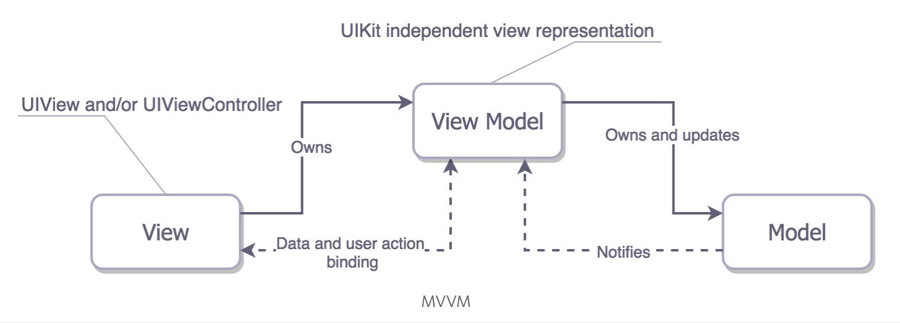

# StarWar Films

## App Goal:
A list of the Star Wars movies with the most recent movie being displayed first.
When selecting a movie, it bring up their information such as release year, director and producer.
A separate section displays the list of the characters appearing in that movie. I used Swapi API (https://swapi.co/api/) for the data.

## Project specifications

Project features:

* 100% [Kotlin](https://kotlinlang.org/)
* [Android Jetpack](https://developer.android.com/jetpack) (ViewModel, LiveData, Lifecycle)
* Clean architecture
* Reactive Programming (RxJava and LiveData)
* Dagger2 Dependency injection (service locator)
* Unit and UI tests (In progress)

## Project Used:
* Android Studio 3.5.3
* Kotlin Version 1.3.40.

## Libraries used

* Google + JetBrains (_Pretty standard default stack nowadays_)
    * [Kotlin](https://kotlinlang.org/)
    * [RxJava](https://github.com/ReactiveX/RxAndroid)
    * [Jetpack](https://developer.android.com/jetpack)
        * [LiveData](https://developer.android.com/topic/libraries/architecture/livedata)
        * [Lifecycle](https://developer.android.com/topic/libraries/architecture/lifecycle)
        * [ViewModel](https://developer.android.com/topic/libraries/architecture/viewmodel)
* Dependency injection (Dagger is easy to use library for managing dependencies, it is perfect for small/mid size projects_)
    * [Dagger2](https://github.com/google/dagger)
* Retrofit2 (Retrofit is a de-facto standard nowadays)
    * [Retrofit](https://square.github.io/retrofit/)
* Tests (_I like Mockk for mocking, prefer it over Mockito. Also found recently about Kakao, which provides a nice DSL over Espresso, which makes writing and reading UI tests more pleasant_)
    * [Unit Tests](https://en.wikipedia.org/wiki/Unit_testing) ([JUnit5](https://junit.org/junit5/))
    * [Mockk](https://mockk.io/)
* Gradle (_Nice way to keep all library dependencies in one centralised place_)
    * [Gradle Kotlin DSL](https://docs.gradle.org/current/userguide/kotlin_dsl.html) 
    

## Design patterns:
### MVVM:
MVVM stands for “Model View ViewModel”, and it’s a software architecture often used by Apple developers to replace MVC. Model-View-ViewModel (MVVM) is a structural design pattern that separates objects into three distinct groups:
- Models hold application data. They’re usually structs or simple classes.
- Views display visual elements and controls on the screen. They’re typically - subclasses of UIView.
- View models transform model information into values that can be displayed on a view. They’re usually classes, so they can be passed around as references.

 ## TODO:
 - Improve UI for good user interface, Keep the interface simple.
 - Cover edge case in Unit test
 - Continuous integration (_Setup basic integration, it runs static analysis tools, unit tests, and assembles builds. Was thinking to run UI tests as well, but the setup is a little bit tricky and due to time constraints, have to postpone the idea_)
    * [Travis CI](https://travis-ci.org/)
 - [Navigation](https://developer.android.com/topic/libraries/architecture/navigation/)
