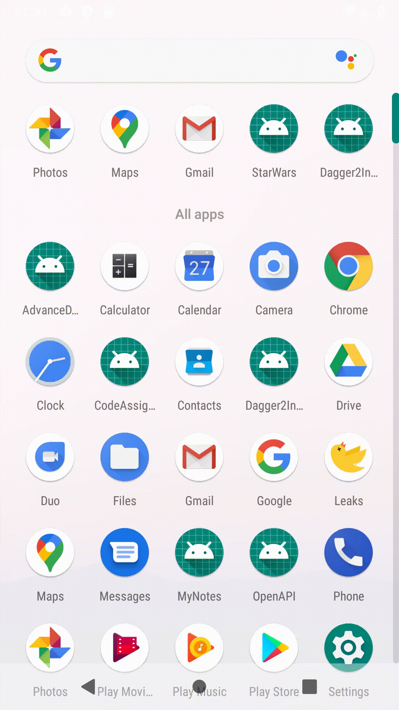

<h1 align="center">Star Wars</h1>

## App Goal:
A list of the Star Wars movies with the most recent movie being displayed first.
When selecting a movie, it bring up their information such as release year, director and producer.
A separate section displays the list of the characters appearing in that movie.

## Project Used:
* Android Studio 3.5.3
* Kotlin Version 1.3.40

## Compatibility
This demo is expected to run in between minSdkVersion 17 to targetSdkVersion 29.

## Libraries Used:
* Dagger 2.2+ (Focus on Dagger-Android)
* Lifecycle Components (ViewModel, LiveData and ReactiveStreams)
* RxJava
* Retrofit2
* JUnit5
* Mockk

 ## TODO:
 - Improve UI for good user interface, Keep the interface simple.
 - Cover edge case in Unit test
